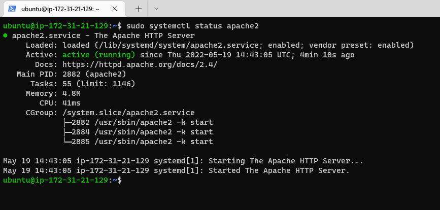
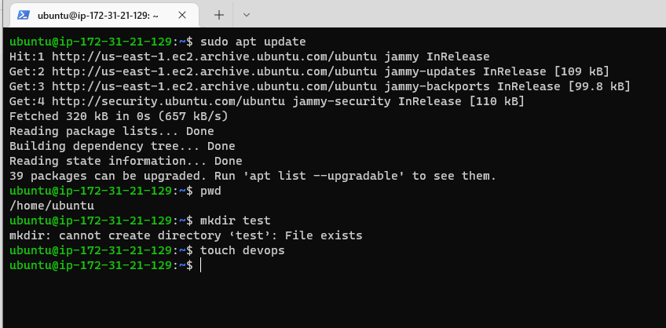
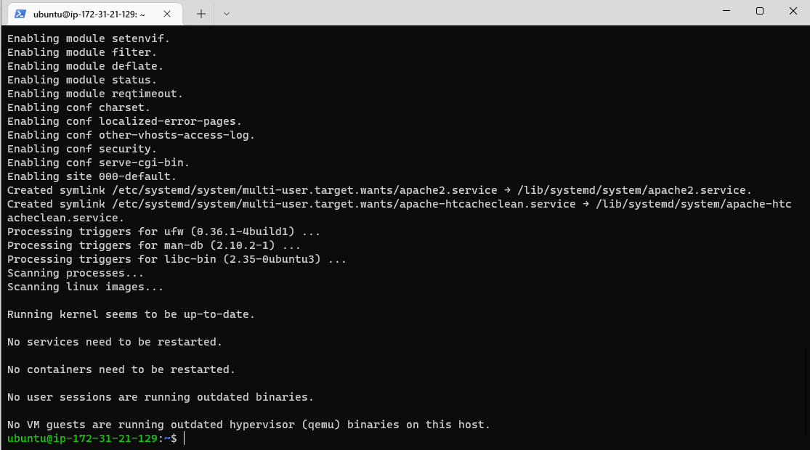

## Efficient Documentation of Project 1

`sudo apt update package list update`

`sudo apt install apache2 package installation`

`sudo systemctl status apache2 verify service running on OS`

[install-open-ssh](https://docs.microsoft.com/en-us/windows-server/administration/openssh/openssh_install_firstuse)

[markdown-repository](https://www.markdownguide.org/cheat-sheet/#overview)
